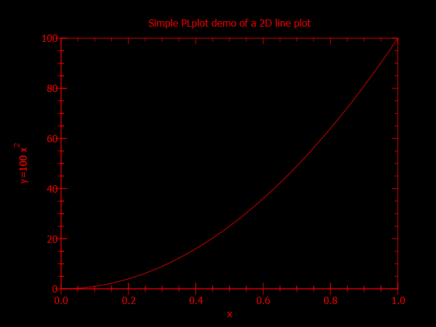

# PLplot examples

## Simple line plot

The following code demonstrates how to create a simple line plot from F#.
All PLplot operations are invoked through an instance of a [PLStream object](xref:PLplot.PLStream).

```fsharp
open System
open PLplot

[<EntryPoint>]
let main argv =
    // create PLplot stream
    use pl = new PLStream()

    // generate data
    let nsize = 101
    let xmin, xmax, ymin, ymax = 0., 1., 0., 100.
    let x, y =
        Array.init nsize (fun i ->
            let x = float i / float (nsize - 1)
            let y = ymax * x * x
            x, y)
        |> Array.unzip

    // Parse and process command line arguments.
    // This grabs PLplot-specific arguments, such as output device, from the
    // command line.
    let mutable argv = argv
    pl.parseopts( &argv, ParseOpts.Full ||| ParseOpts.NoProgram ) |> ignore

    // Initialize plplot
    pl.init()

    // Create a labelled box to hold the plot.
    pl.env( xmin, xmax, ymin, ymax, AxesScale.Independent, AxisBox.BoxTicksLabelsAxes )
    pl.lab( "x", "y=100 x#u2#d", "Simple PLplot demo of a 2D line plot" )

    // Plot the data that was prepared above.
    pl.line( x, y )

    // PLplot is automatically closed when pl is disposed.
    0
```

The project must reference the PLplot package.
This can be done by executing the following command inside the project directory.

```dotnet add package PLplot```

When run, the above program produces the following output.



Don't worry, the colors can be customized easily using the [spal0 function](xref:PLplot.PLStream.spal0*).
Read the [official guide](http://plplot.sourceforge.net/docbook-manual/plplot-html-5.13.0/color.html) for more information.

## More examples

Further examples are located in the project repository at <https://github.com/surban/PLplotNet/tree/master/Samples>.

The [native PLplot example gallery](http://plplot.sourceforge.net/examples.php) demonstrates all possible plot types the library has to offer.

